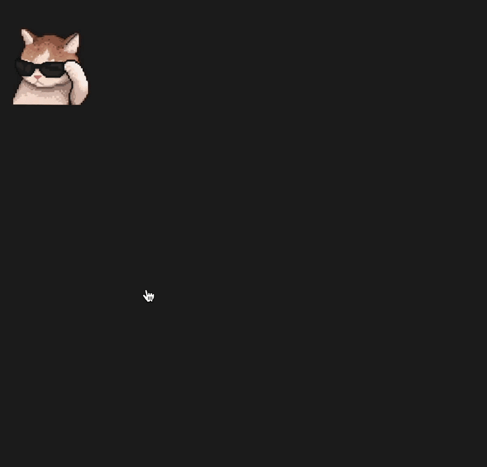

# CatGPT

A floating desktop character for macOS that gives you a real ChatGPT or
Claude session without switching windows. Click the cat, chat, get on
with your work.




## What it does

- Sits on top of your other windows as a small, draggable character
- Click to open a real ChatGPT or Claude session (your actual logged-in
  account - not the API, no per-message cost)
- Switch between GPT and Claude with a toggle in the chat header
- Reacts to what's happening: idle by default, a hover animation when
  you mouse over it, and a "thinking" animation while a reply streams
- Resizable chat window, refresh button, right-click to quit

## How it works

```
NSPanel (borderless, floating, always on top)
   └── CharacterView (SwiftUI)
          ├── idle / hover / thinking states - sprite sheets
          └── tap → ChatOverlayView
                       ├── model picker (GPT / Claude)
                       └── ChatWebView (WKWebView) → chatgpt.com or claude.ai
                                 └── injects a small JS poller that watches
                                     for the page's own "stop generating"
                                     button, to detect when a reply is
                                     still streaming
```

No OpenAI or Anthropic API key required: the app embeds each provider's
actual website and your login persists across launches, the same way a
browser tab would.

## Setup

1. Open the project in Xcode (macOS App, SwiftUI).
2. Build and run. A character should appear near the top-right of your
   screen.
3. Click it, log into ChatGPT or Claude once inside the embedded view:
   it remembers you after that.
4. Enable outgoing network access if prompted: target →
   Signing & Capabilities → App Sandbox → check **Outgoing Connections
   (Client)**.

## Known limitations

- The "thinking" detection is a DOM heuristic (watching for each site's
  own stop-generating button), not an official API - if OpenAI or
  Anthropic changes their page markup, it may need a selector update.
- Character artwork is placeholder sprite sheets; swap the assets in
  `Assets.xcassets` for your own.
- No persistence of app-side settings (selected model resets on
  relaunch) - a small enhancement if you want it.
